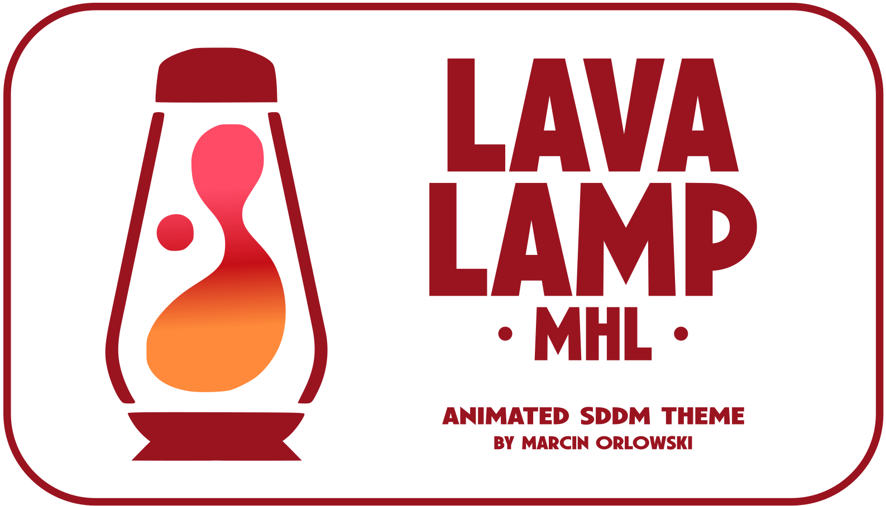
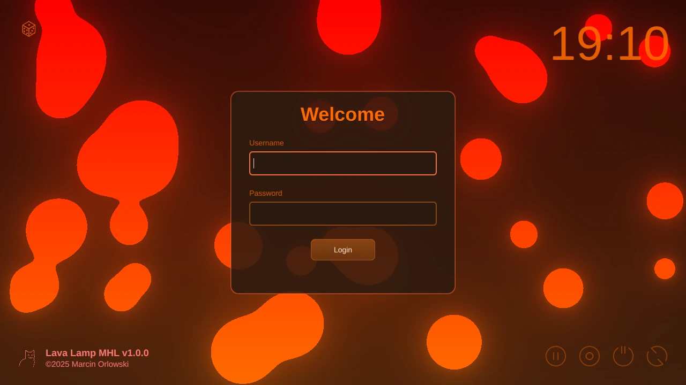
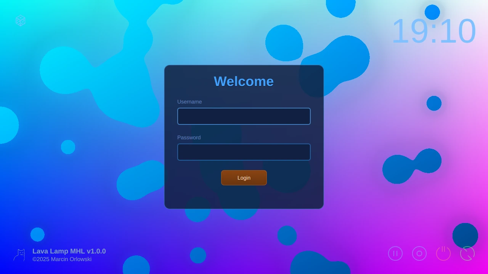
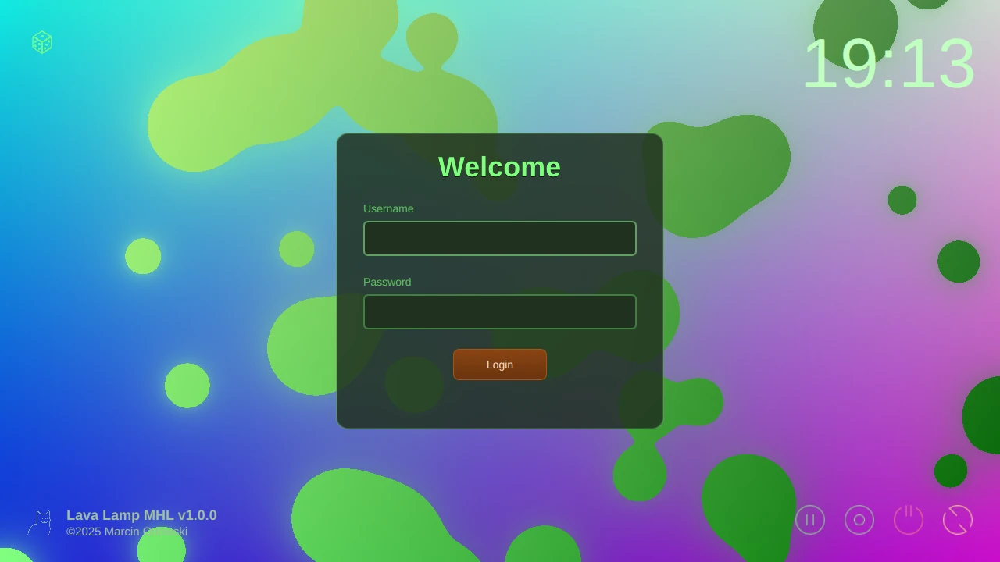

# Lava Lamp animated SDDM theme

- [What is it?](#what-is-it)
- [Installation](#installation)
- [Configuration](#configuration)
- [License](#license)
- [Changelog](CHANGES.md)

______________________________________________________________________

## What is it?

Lava Lamp is an animated [SDDM dynamic theme](https://github.com/sddm/sddm/) stylized after the
classic [lava lamp](https://wikipedia.org/wiki/Lava_lamp). It features a mesmerizing animation of
colorful blobs that move and change shape, creating a relaxing and soothing visual effect. The theme
is designed to be visually appealing and to provide a unique and engaging user experience.

### Themes

Comes in multiple color themes to suit your liking.

#### Heat



#### Ocean



#### Forest



## Installation

You can install Lava Lamp MHL theme in multiple ways:

- using KDE store via KDE SDDM control panel
- manually by downloading the ZIP archive
- installing Debian/Ubuntu package (.deb)

### KDE Store

The KDE Store](https://store.kde.org/p/2307838) page.

To install the Lava Lamp MHL theme from KDE Store use SDDM control panel built into KDE Plasma:

- Go to `Settings -> System Settings`,
- Search for `SDDM` and open `Login Screen (SDDM)` section,
- On the bottom, click `Get new SDDM Themes...` button,
- Search for `Lava Lamp MHL` and install it.
- Click `Apply` button to apply the theme.

### Manual installation

- Go to [Releases](https://github.com/MarcinOrlowski/sddm-lavalamp-mhl/releases) section
- Choose release you need and download ZIP archive of it (`sddm-theme-lavalamp-mhl-<VERSION>.zip`).
- Go to `Settings -> System Settings`,
- Search for `SDDM` and open `Login Screen (SDDM)` section,
- On the bottom, click `Install from file...` button,
- Select downloaded ZIP archive and click `Open` button,
- Click `Apply` button to apply the theme.

### Debian/Ubuntu Package

For Debian and Ubuntu users, you can install the theme using a `.deb` package:

- Go to [Releases](https://github.com/MarcinOrlowski/sddm-lavalamp-mhl/releases) section
- Download the latest `sddm-theme-lavalamp-mhl_<VERSION>_all.deb` file
- Install the package:
  ```bash
  sudo dpkg -i sddm-theme-lavalamp-mhl_<VERSION>_all.deb
  ```
- If there are dependency issues, fix them with:
  ```bash
  sudo apt-get install -f
  ```
- **Enable the theme:**
  - Go to `Settings -> System Settings -> Login Screen (SDDM)`,
  - Select `Lava Lamp MHL` from the theme list,
  - Click `Apply` button to apply the theme.

**Note:** The package prevents accidental removal if the theme is currently active. To remove the
package, first change to another theme, then run `sudo apt remove sddm-theme-lavalamp-mhl`.

## Configuration

There's no configuration required, but if you fancy specific theme style, you can set it
by editing `/usr/share/sddm/themes/lavalamp-mhl/theme.conf` file as per instructions provided
in that file.

## Feedback

The Lava Lamp MHL theme is available on the [KDE Store](https://store.kde.org/p/2307838). Please
do comment and rate it if you like the theme. Your feedback is appreciated!

Please do post your feature requests or issue reports
to [GitHub Issues](https://github.com/MarcinOrlowski/sddm-lavalamp-mhl/issues) page of the project.

## License

- Written and copyrighted ©2025 by Marcin Orlowski <mail (#) MarcinOrlowski (.) com>
- Lava Lamp MHL is open-source software licensed under
  the [MIT license](http://opensource.org/licenses/MIT)
- SVG icons from: https://www.svgrepo.com/
