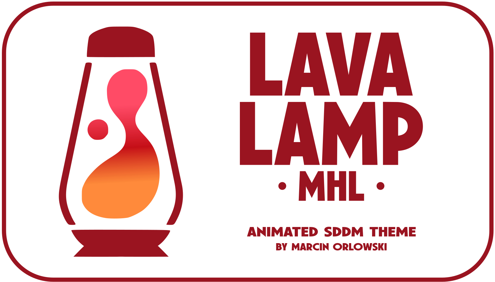
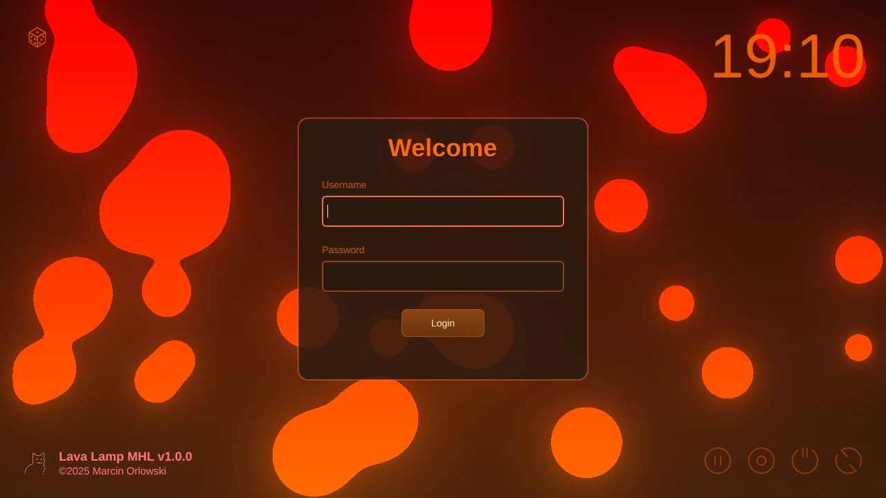
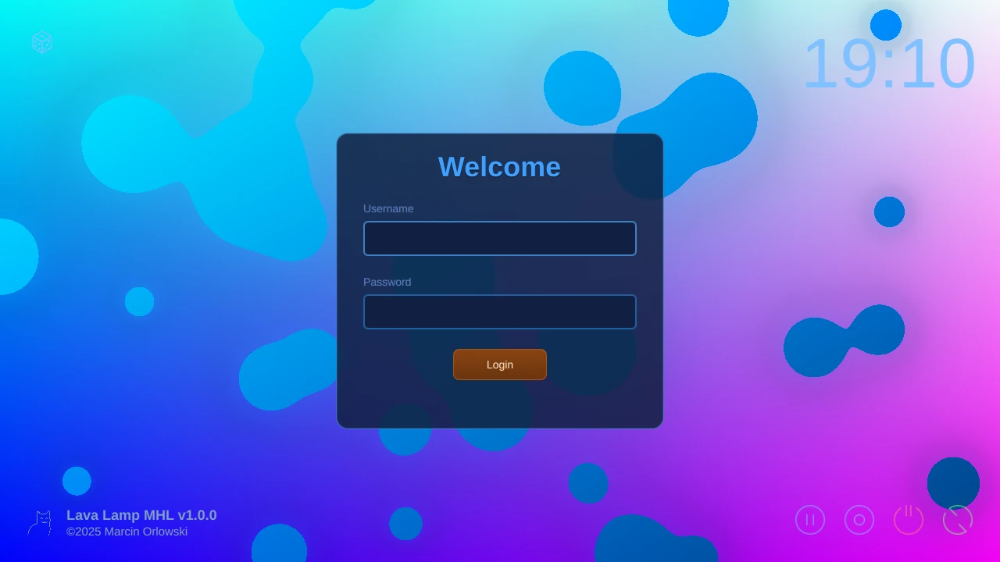
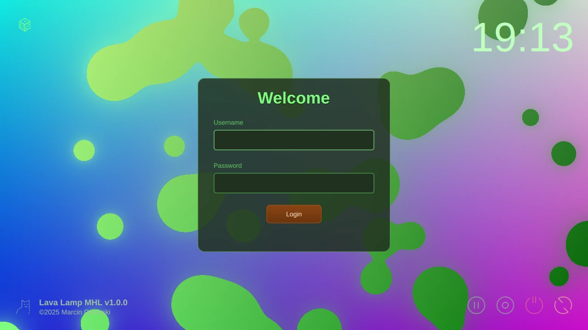

# Lava Lamp animated SDDM theme

- [What is it?](#what-is-it)
- [Installation](docs/README.md)
- [Configuration](#configuration)
- [License](#license)
- [Development](docs/dev.md)
- [Changelog](CHANGES.md)

______________________________________________________________________

## What is it?

Lava Lamp is an animated [SDDM dynamic theme](https://github.com/sddm/sddm/) stylized after the
classic [lava lamp](https://wikipedia.org/wiki/Lava_lamp). It features a mesmerizing animation of
colorful blobs that move and change shape, creating a relaxing and soothing visual effect. The theme
is designed to be visually appealing and to provide a unique and engaging user experience.

### Themes

Comes in multiple color themes to suit your liking.

#### Heat

#### Ocean

#### Forest

## Configuration

There's no configuration required, but if you fancy specific theme style, you can set it
by editing `/usr/share/sddm/themes/lavalamp-mhl/theme.conf` file as per instructions provided
in that file.

## Feedback

The Lava Lamp MHL theme is available on the [KDE Store](https://store.kde.org/p/2307838). Please
do comment and rate it if you like the theme. Your feedback is appreciated!

Please do post your feature requests or issue reports
to [GitHub Issues](https://github.com/MarcinOrlowski/sddm-lavalamp-mhl/issues) page of the project.

## License

- Written and copyrighted ©2025 by Marcin Orlowski <mail (#) MarcinOrlowski (.) com>
- Lava Lamp MHL is open-source software licensed under
  the [MIT license](http://opensource.org/licenses/MIT)
- SVG icons from: https://www.svgrepo.com/
