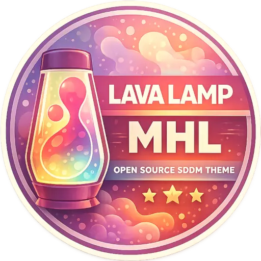
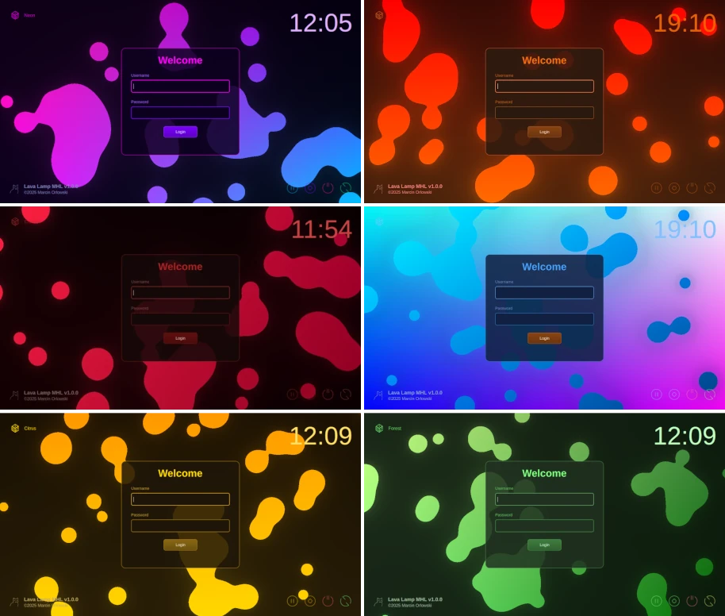

# Lava Lamp animated SDDM theme

Lava Lamp is an animated [SDDM dynamic theme](https://github.com/sddm/sddm/) stylized after the
classic [lava lamp](https://wikipedia.org/wiki/Lava_lamp). It features a mesmerizing animation of
colorful blobs that move and change shape, creating a relaxing and soothing visual effect. The theme
is designed to be visually appealing and to provide a unique and engaging user experience.

See [Installation](docs/README.md) document for theme installation guides.

## Themes

Comes in multiple color themes to suit your liking: Arctic, Citrus, [Crimson](img/preview-crimson.webp),
[Forest](img/preview-forest.webp), [Heat](img/preview-heat.webp), Neon, [Ocean](img/preview-ocean.webp)
and Sunset. You can always change the visible theme at runtime by using "dice" icon located in 
upper-left corner of your screen.

## Developers

Interested in contributing to the project? See [developer docs](docs/dev.md) first.

## Feedback

The Lava Lamp MHL theme is available on the [KDE Store](https://store.kde.org/p/2307838). Please
do comment and rate it if you like the theme. Your feedback is appreciated!

Please do post your feature requests or issue reports
to [GitHub Issues](https://github.com/MarcinOrlowski/sddm-lavalamp-mhl/issues) page of the project.

## License

- Written and copyrighted ©2025-2026 by Marcin Orlowski <mail (#) MarcinOrlowski (.) com>
- Lava Lamp MHL is open-source software licensed under
  the [MIT license](http://opensource.org/licenses/MIT)
- SVG icons from: https://www.svgrepo.com/
